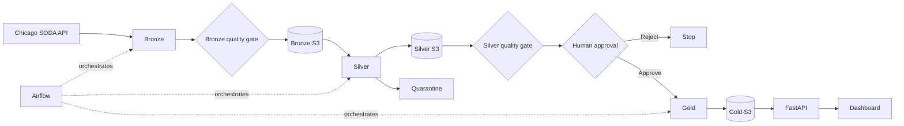
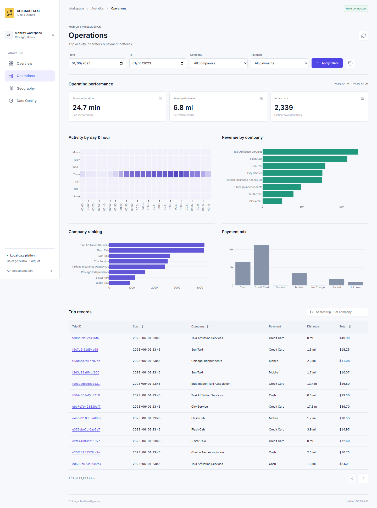
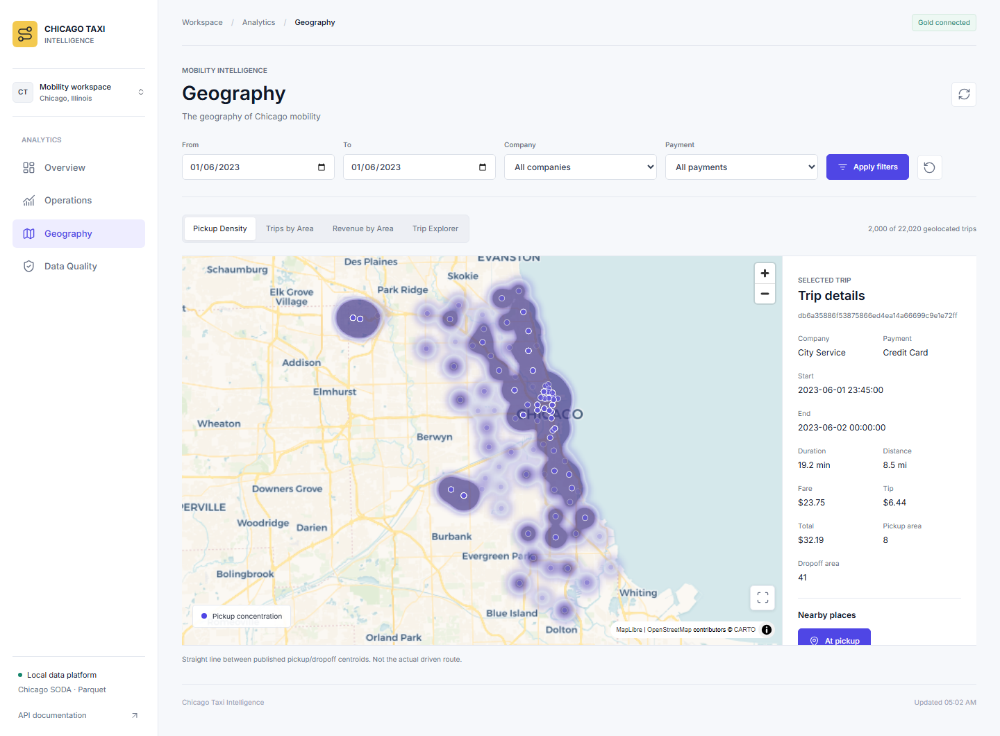
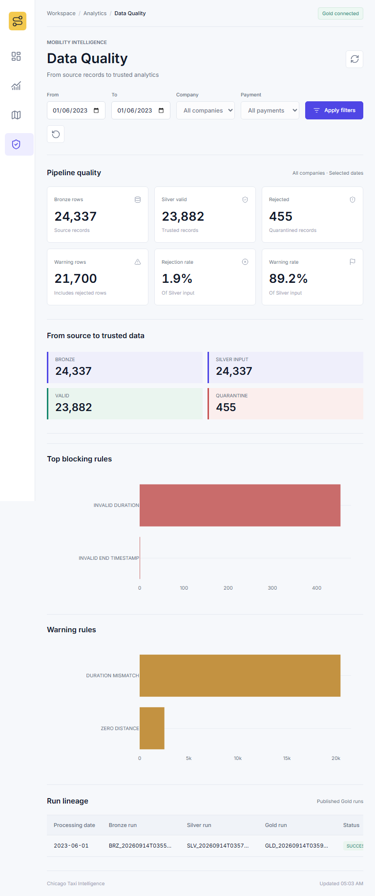

# Chicago Taxi Data Engineering Pipeline

Local data pipeline built from the public Chicago Taxi Trips dataset. PySpark
processes daily partitions through Bronze, Silver and Gold layers. Airflow
orchestrates the jobs, SeaweedFS provides S3-compatible storage, and FastAPI
exposes the curated data to a small analytical dashboard.

## Architecture



| Component | Responsibility |
|---|---|
| PySpark | Parsing, data quality rules and aggregations |
| Airflow | Daily and date-range orchestration |
| SeaweedFS / S3 | Persistent storage for each Medallion layer |
| PostgreSQL | Airflow metadata |
| FastAPI | Gold datasets and data-quality API |
| Dashboard | Demonstration of Gold data consumption |

## Repository structure

| Path | Content |
|---|---|
| `config/` | Source, paths and quality thresholds |
| `dags/` | Daily DAG and date-range controller DAG |
| `src/bronze/` | SODA ingestion and raw persistence |
| `src/silver/` | Schema, casting, quality rules and quarantine |
| `src/gold/` | Analytical tables and reconciliations |
| `src/dataops/` | Publication checks and run audit |
| `src/api/` | FastAPI routes and Gold readers |
| `tests/` | Focused unit and integration tests |
| `docker/` | Airflow and API images |
| `docs/` | Detailed implementation notes and evidence |
| `notebooks/` | Executed Pandas draft used as functional reference |

## Data pipeline

### Bronze

- Filters the SODA API on `trip_start_timestamp`.
- Uses deterministic ordering and offset pagination.
- Preserves the JSON response before business transformations.
- Writes an all-string Parquet dataset partitioned by `processing_date`.
- Records row counts, pagination status and a run manifest.

Chicago SODA exposes several formats. JSON is used here because the source is
queried and paginated through the API. The unmodified response is retained in
Bronze before any casting or business rule.

### Silver

- Applies an explicit PySpark schema and safe casts.
- Normalizes column names and derives date, duration and tip fields.
- Applies blocking errors and non-blocking warnings.
- Keeps one deterministic record per `trip_id`.
- Writes trusted records to Silver and rejected records to Quarantine.

### Gold

Gold produces datasets ready for API or BI consumption:

`kpi_summary`, `daily`, `hourly`, `zones`, `companies`, `payments`, `trips`,
and `geo`.

## Data Quality

| Stage | Main controls |
|---|---|
| Bronze | Required columns, null profile, duplicates, pagination completeness |
| Silver | Valid timestamps, positive duration, non-negative distance and amounts |
| Reconciliation | `input_rows = valid_rows + rejected_rows` |
| Warning threshold | Rejection rate from 2% to less than 5% |
| Failure threshold | Rejection rate at or above 5%, empty or incomplete input |

Critical failures stop the pipeline. Rejected rows remain available in
Quarantine with their rule names. Manifests, lineage, checksums, immutable run
prefixes and conditional `latest.json` publication are documented in
[docs/storage.md](docs/storage.md).

After the automated Silver gate passes, Airflow pauses on
`approve_data_and_business_quality`. A reviewer checks reconciliation,
rejection rate and business consistency, then clicks **Approve** to continue to
Gold or **Reject** to stop the partition. The decision uses Airflow's native
Human-in-the-Loop interface; no separate service is required.

## Orchestration

The daily DAG keeps processing and orchestration separate:

```text
bronze -> validate_bronze -> silver -> quality_gate
       -> human approval -> gold -> validate_gold
```

Business logic remains in `src/`, so every layer can run outside Airflow and be
tested independently.

`chicago_taxi_range_pipeline` accepts `start_date` and `end_date`, builds the
inclusive list of dates, then uses Airflow Dynamic Task Mapping to trigger one
daily DAG run per partition. The daily DAG remains the unit of idempotence and
allows one active run at a time in the local stack. Each daily run waits for
its own approval before Gold.

## Idempotence

`processing_date` is the replacement boundary. Reprocessing a date writes to
a temporary path, validates the result, then replaces only that date's visible
partition. A new `run_id` is created for audit and immutable S3 history, but it
does not change the business partition key.

This makes retries and backfills safe: a failed write cannot expose a partial
partition, completed dates do not need to be deleted, and rerunning the same
input produces the same Gold business content and KPI. Concurrent writes for
the same date remain intentionally disabled.

## Run locally

Prerequisite: Docker Desktop using Linux containers.

```powershell
docker compose up --build -d
docker compose ps
docker compose exec airflow airflow dags trigger chicago_taxi_batch_pipeline
```

| Service | URL / credentials |
|---|---|
| Dashboard | http://localhost:18000 |
| API documentation | http://localhost:18000/docs |
| Airflow | http://localhost:18080 (`artefact` / `chicago-local`) |
| Object storage | http://localhost:18888 |

Stop the stack without deleting data:

```powershell
docker compose stop
```

## Dataset and processing window

Each partition covers one calendar day:

```text
trip_start_timestamp >= processing_date 00:00:00
trip_start_timestamp <  processing_date + 1 day 00:00:00
```

The source page size is 50,000 rows with at most two pages per day. An
incomplete daily extraction is rejected by the Bronze quality gate.

### Partition storage

Each layer uses Hive-style daily paths in the Spark workspace:

```text
data/bronze/chicago_taxi/processing_date=2023-06-01/
data/silver/chicago_taxi/processing_date=2023-06-01/
data/quarantine/chicago_taxi/processing_date=2023-06-01/
data/gold/chicago_taxi/processing_date=2023-06-01/
```

The same partition is published to immutable S3 run prefixes. A small pointer
selects the latest validated run without deleting older snapshots:

```text
<layer>/processing_date=2023-06-01/runs/<run_id>/...
<layer>/processing_date=2023-06-01/latest.json
```

Daily partitioning limits API reads and Spark work, enables partition pruning,
isolates failures, and provides a clear idempotent replacement boundary. A
failed 45-day backfill can restart without rebuilding unrelated dates.

Measured local sizes for the validated `2023-06-01` partition are:

| Layer | Rows | Files | Size |
|---|---:|---:|---:|
| Bronze | 24,337 | 6 | 27.64 MB |
| Silver | 23,882 | 18 | 3.52 MB |
| Quarantine | 455 | 18 | 0.22 MB |
| Gold | 23,882 trips across 8 datasets | 34 | 3.29 MB |

Partition size is not fixed. It depends on daily volume, source JSON size,
Parquet compression and the number of Spark output files. Bronze is larger
because it retains both the raw JSON response and the Parquet representation.

### Quick demo

The validated date is `2023-06-01`: 24,337 Bronze rows and complete pagination.

```powershell
docker compose exec airflow airflow dags trigger chicago_taxi_batch_pipeline --conf '{"processing_date":"2023-06-01"}'
```

### Scale demo

A wider period orchestrates the same daily partitions. No multi-week benchmark
is claimed in this repository.

The scale window selected for this project is `2019-06-01` to `2019-07-15`:
45 daily partitions. A SODA count query returns 2,076,606 source rows, and the
largest observed day in June-July contains 60,055 rows, below the configured
100,000-row daily pagination capacity.

From the Airflow UI, trigger `chicago_taxi_range_pipeline` with these dates.
Airflow pauses each daily partition for human approval. The equivalent
unattended backfill command keeps all automated quality gates but does not ask
for an Airflow click:

```powershell
docker compose exec airflow python -m scripts.run_date_range --start-date 2019-06-01 --end-date 2019-07-15
```

Ranges are inclusive and limited to 92 days per invocation. The source count is
a preflight measure; processed and accepted row counts are reported separately
after the backfill completes.

## Dashboard and API

The dashboard consumes already-published Gold partitions. Date and company
filters do not trigger Spark or Airflow. A new date appears after its DAG has
finished and Gold has been published. The application provides Overview,
Operations, Geography and Data Quality views.

Without an explicit date filter, the API reads only the latest Gold partition.
For a selected range, it loads only matching daily snapshots. This keeps the
interactive path bounded as the historical store grows.

The current dashboard is a local consumption demo over historical data, not a
live trip feed. CARTO configuration is read from an untracked `.env.local` file.

### Dashboard screens

| Screen | Purpose |
|---|---|
|  | **Overview** shows headline KPIs, revenue and trip trends for the selected Gold partition. It is the first operational check after publication. |
|  | **Operations** compares hourly activity, payment types and companies, and provides paginated trip-level inspection. |
|  | **Geography** displays pickup density, zone performance and pickup-to-dropoff centroid links. Lines are analytical links, not GPS routes. |
|  | **Data Quality** exposes trusted, rejected and warning counts plus the rules behind quarantine. These metrics support the Airflow human approval. |

Mobile layouts are also included in `docs/reports/` at 390 px and 768 px.

## Validation

| Check | Result |
|---|---|
| Docker Compose services | PASS |
| End-to-end Airflow DAG | PASS |
| Source pagination | Complete |
| Bronze / Silver / rejected reconciliation | PASS |
| Gold reconciliation | PASS |
| Idempotent rerun | Same KPI and business hash |
| Unit and integration tests | 37 passed, 1 skipped |
| Date-range helper | 3 passed |
| S3 publication test | PASS |
| Frontend checks | 19 PASS |

Evidence is stored in [docs/reports](docs/reports). These results apply to the
daily quick demo; the new date-range controller is not presented as a completed
large-volume benchmark.

## Technical choices and limits

- Daily partitions provide simple reruns and replacement boundaries.
- S3 run prefixes are immutable; `latest.json` changes only after validation.
- Spark uses local disk as working space before S3 publication.
- Bronze currently accumulates one API page set in Python memory.
- The API loads Gold trip projections in memory and targets local analytics.
- Concurrent processing of the same date is not supported.
- Map lines connect published centroids; they are not GPS routes.

With more time: direct Spark S3A access, transactional table format, streamed
SODA ingestion, retention policies, distributed locking and CI execution of the
Compose acceptance checks.

## Possible extension: Fare Prediction

The current project stops at the curated Gold layer and analytical API. A
natural ML extension would predict `fare` before trip departure from pickup and
dropoff community areas, start hour, day of week, estimated distance and
estimated duration. `trip_total` and `tips` would not be used because they are
unknown before the trip and would introduce leakage.

```text
Gold history -> feature engineering -> regression model
             -> MLflow tracking / registry -> prediction API -> fare estimate
Observed trips -> error and drift monitoring -> retraining dataset
```

The lifecycle could reuse the principles demonstrated in
[FraudOps MLOps Demo](https://github.com/MedEleliem/fraudops-mlops-demo):
reproducible datasets, experiment tracking, controlled model promotion and a
lightweight FastAPI serving service. This extension is not implemented here.

Detailed documentation: [architecture](docs/architecture.md),
[Airflow](docs/airflow.md), [Docker](docs/docker.md),
[Bronze](src/bronze/README.md), [Silver](src/silver/README.md),
[Gold](src/gold/README.md),
[DataOps](docs/dataops.md), [API](docs/api.md).
