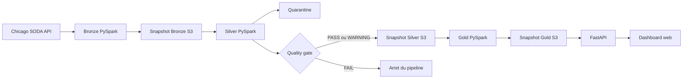

# Chicago Taxi Trips - Data Engineering Project

Ce projet part du notebook Pandas fourni pour le test technique. Mon objectif
etait de garder la logique facile a lire, puis de la transformer en une vraie
chaine data que je peux relancer, controler et servir dans une application web.

La version finale utilise PySpark pour les traitements, Airflow pour
l'orchestration, un stockage compatible S3 pour les donnees, FastAPI pour l'API
et du HTML/CSS/JavaScript simple pour le dashboard.


## Le point important sur les dates

Le pipeline travaille par journee. Le parametre `processing_date=2023-06-01`
veut dire :

```text
trip_start_timestamp >= 2023-06-01T00:00:00
trip_start_timestamp <  2023-06-02T00:00:00
```

La borne de debut est incluse et celle du lendemain est exclue. Cela evite de
lire deux fois un trajet situe exactement a minuit quand je traite plusieurs
jours.

L'API SODA est lue par pages de 50 000 lignes, avec deux pages maximum dans la
configuration actuelle. Le lot peut donc contenir jusqu'a 100 000 lignes. Le
`2023-06-01`, utilise pour la validation, contient 24 337 lignes : l'extraction
est complete des la premiere page. Si une autre journee depasse la limite,
DataOps bloque la suite car `require_complete_bronze` vaut `true`.

Changer la date dans le dashboard ne lance pas Airflow. Le selecteur sert
seulement a lire une date Gold deja publiee. Pour ajouter une nouvelle date, il
faut declencher le DAG ou lancer le pipeline manuellement, puis actualiser la
page.

## Comment les donnees circulent



### Bronze

Bronze telecharge la journee demandee depuis le dataset Chicago Taxi Trips
`wrvz-psew`. Je conserve la reponse JSON brute et un Parquet avec toutes les
colonnes en texte. A ce niveau, je ne corrige pas les valeurs : je garde ce que
la source m'a donne et j'enregistre le nombre de pages, de lignes et le statut
de la pagination.

### Silver

Silver applique le schema PySpark, convertit les timestamps et les nombres,
puis separe les lignes valides des lignes rejetees. Les erreurs sont par exemple
un identifiant absent, une duree negative ou un montant incoherent. Les champs
moins critiques, comme une coordonnee manquante, restent dans Silver avec un
warning.

Je garde une seule ligne valide par `trip_id`. En cas de doublon, le choix est
deterministe : une ligne sans erreur passe en premier, puis les valeurs sont
comparees dans un ordre stable. Les autres occurrences vont en quarantaine avec
`DUPLICATE_TRIP_ID_EXCLUDED`.

### DataOps

Apres Bronze et Silver, le quality gate controle les manifests, les compteurs,
la reconciliation `input = valid + rejected`, le taux de rejet et la fin de la
pagination. Un lot vide ou incomplet est refuse. Le seuil de warning est 2 % et
le seuil d'echec est 5 %.

### Gold

Gold ne lit que Silver Trusted. Il produit huit tables Parquet :

- `kpi_summary` pour les chiffres globaux ;
- `daily` et `hourly` pour l'evolution dans le temps ;
- `zones`, `companies` et `payments` pour les analyses par dimension ;
- `trips` pour la liste et le detail des trajets ;
- `geo` pour les points et les liaisons affiches sur la carte.

Les lignes de la carte relient les centroides pickup et dropoff. Elles montrent
une origine et une destination, pas la route GPS reellement suivie par le taxi.

## Pourquoi un stockage objet

Les dossiers locaux servent seulement d'espace de travail a Spark. Chaque
couche validee est envoyee dans SeaweedFS avec l'API S3 de boto3. Une publication
a son propre `run_id`, son inventaire de fichiers et ses checksums SHA-256.

Une relance sur la meme date ne detruit pas l'ancien run. Elle cree un nouveau
snapshot, puis remplace le petit pointeur `latest.json` seulement lorsque tous
les fichiers ont ete envoyes et verifies. Si l'upload echoue au milieu, l'ancien
snapshot reste visible.

L'API dispose de son propre cache et recupere Gold depuis S3. Elle ne partage
pas le dossier de travail d'Airflow.

## Lancer le projet avec Docker

Il faut Docker Desktop en mode conteneurs Linux. Depuis la racine du depot :

```powershell
docker compose up --build -d
docker compose ps
```

Les quatre services doivent etre `healthy` :

- `object-store` : stockage S3 SeaweedFS ;
- `postgres` : metadonnees Airflow ;
- `airflow` : orchestration et jobs PySpark ;
- `api` : FastAPI et dashboard.

Au premier lancement, la construction de l'image Airflow peut prendre plusieurs
minutes car elle installe Java et PySpark.

| Service | Adresse |
|---|---|
| Dashboard | http://localhost:18000 |
| Documentation API | http://localhost:18000/docs |
| Airflow | http://localhost:18080 |
| Stockage | http://localhost:18888 |
| Endpoint S3 | http://localhost:18333 |

Airflow utilise les identifiants locaux `artefact / chicago-local`.

## Lancer une date

Pour la date par defaut `2023-06-01` :

```powershell
docker compose exec airflow airflow dags trigger chicago_taxi_batch_pipeline
docker compose logs -f airflow
```

Pour une autre date, je peux utiliser le formulaire **Trigger DAG** dans
Airflow et remplir `processing_date`. Je peux aussi executer la chaine sans le
DAG :

```powershell
docker compose exec airflow python -m scripts.run_pipeline --processing-date 2023-06-02
```

Pour lancer les couches une par une :

```powershell
docker compose exec airflow python -m scripts.run_stage --layer bronze --processing-date 2023-06-02
docker compose exec airflow python -m scripts.run_stage --layer silver --processing-date 2023-06-02
docker compose exec airflow python -m scripts.run_stage --layer gold --processing-date 2023-06-02
```

Je ne lance pas deux traitements en meme temps sur la meme date, car ils
partagent encore un espace de travail local.

Pour arreter les services sans supprimer les donnees :

```powershell
docker compose stop
```

`docker compose down -v` supprime les volumes. Je ne l'utilise donc pas si je
veux garder les snapshots et l'historique Airflow.

## Ce que montre le dashboard

Le dashboard contient quatre vues :

- **Overview** : KPI et tendances principales ;
- **Operations** : volumes horaires, paiements, entreprises et liste des trips ;
- **Geography** : pickups, revenus par zone et detail d'un trajet sur la carte ;
- **Data Quality** : lignes valides, rejets, warnings et erreurs detectees.

Les filtres de date et d'entreprise sont envoyes a FastAPI. L'API lit les
tables Gold correspondantes et renvoie du JSON. Spark n'est jamais lance par
une requete web. Foursquare est facultatif et sert uniquement a chercher des
lieux proches d'un point selectionne.

La cle CARTO est lue depuis `.env.local`, qui est ignore par Git et exclu des
images Docker. `.env.example` montre seulement les noms des variables attendues.

## Tests et resultats obtenus

La suite complete dans l'image Linux finale donne :

```text
37 passed, 1 skipped
```

Le test ignore par defaut est l'integration S3 destructive. Je l'ai lancee
separement contre le stockage Compose et elle passe. Le controle navigateur
contient 19 checks : graphiques, filtres, pagination, carte, tuiles CARTO,
details des trajets, qualite, responsive mobile et absence d'erreur JavaScript.

Pour relancer les tests :

```powershell
docker compose exec -T -e S3_ENDPOINT_URL= airflow python -m pytest tests -q -p no:cacheprovider

$env:CHICAGO_TEST_URL="http://127.0.0.1:18000"
python -m scripts.check_frontend

python scripts/check_release.py --processing-date 2023-06-01 --runs 2
```

`check_release.py` declenche deux DAGs sur la meme date et compare les KPI, le
nombre d'identifiants uniques et le hash du contenu Gold. Les deux runs valides
ont produit 24 337 lignes Bronze, 23 882 lignes Gold et 455 rejets, avec le meme
hash metier mais de nouveaux `run_id`.

Les preuves sont dans [docs/reports](docs/reports) et le bilan detaille est dans
[docs/reports/livraison.md](docs/reports/livraison.md).

## Organisation du depot

```text
config/                 configuration et seuils
dags/                   DAG Airflow
docker/                 images Airflow et API
frontend/               HTML, CSS et JavaScript
scripts/                lancement, validation et tests de release
src/bronze/             ingestion SODA
src/silver/             typage, controles et quarantaine
src/gold/               tables analytiques
src/dataops/            quality gates et audits
src/api/                FastAPI
src/object_store.py     publication et restauration S3
tests/                  tests unitaires et integration
docs/                   explications et preuves
```

Pour comprendre le code dans l'ordre, je conseille de lire
[l'architecture](docs/architecture.md), puis [Bronze](docs/bronze.md),
[Silver](docs/silver.md), [Gold](docs/gold.md), [le stockage](docs/storage.md),
[Airflow](docs/airflow.md) et enfin [l'API](docs/api.md) avec
[le frontend](docs/frontend.md).

## Choix et limites

J'ai choisi des modules Python simples plutot qu'un framework supplementaire.
Le DAG orchestre des commandes mais ne contient pas les transformations. Cette
separation permet de tester chaque couche sans demarrer Airflow.

Cette version reste adaptee a un test local et a une fenetre journaliere :

- Bronze accumule la reponse du jour en memoire avant de creer le DataFrame ;
- l'API charge les trajets Gold en RAM ;
- les montants utilisent `DOUBLE`, comme dans le notebook de reference ;
- les timestamps ne sont pas convertis vers un autre fuseau ;
- les assets web et les tuiles cartographiques demandent Internet ;
- il n'y a pas encore de verrou distribue entre deux pipelines concurrents.

Pour aller plus loin, je passerais a une lecture S3A directe dans Spark, un
format transactionnel, une extraction SODA en streaming, une politique de
retention, un moteur SQL analytique et une CI qui reconstruit Compose et rejoue
les tests automatiquement.
