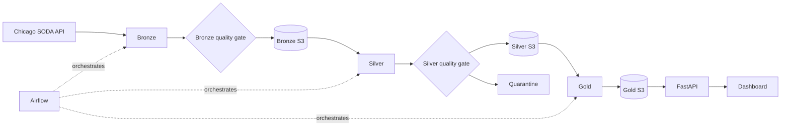

# Chicago Taxi Data Engineering Pipeline

Local data pipeline built from the public Chicago Taxi Trips dataset. PySpark
processes daily partitions through Bronze, Silver and Gold layers. Airflow
orchestrates the jobs, SeaweedFS provides S3-compatible storage, and FastAPI
exposes the curated data to a small analytical dashboard.

## Architecture



| Component | Responsibility |
|---|---|
| PySpark | Parsing, data quality rules and aggregations |
| Airflow | Daily and date-range orchestration |
| SeaweedFS / S3 | Persistent storage for each Medallion layer |
| PostgreSQL | Airflow metadata |
| FastAPI | Gold datasets and data-quality API |
| Dashboard | Demonstration of Gold data consumption |

## Repository structure

| Path | Content |
|---|---|
| `config/` | Source, paths and quality thresholds |
| `dags/` | Daily DAG and date-range controller DAG |
| `src/bronze/` | SODA ingestion and raw persistence |
| `src/silver/` | Schema, casting, quality rules and quarantine |
| `src/gold/` | Analytical tables and reconciliations |
| `src/dataops/` | Publication checks and run audit |
| `src/api/` | FastAPI routes and Gold readers |
| `tests/` | Focused unit and integration tests |
| `docker/` | Airflow and API images |
| `docs/` | Detailed implementation notes and evidence |
| `notebooks/` | Executed Pandas draft used as functional reference |

## Data pipeline

### Bronze

- Filters the SODA API on `trip_start_timestamp`.
- Uses deterministic ordering and offset pagination.
- Preserves the JSON response before business transformations.
- Writes an all-string Parquet dataset partitioned by `processing_date`.
- Records row counts, pagination status and a run manifest.

Chicago SODA exposes several formats. JSON is used here because the source is
queried and paginated through the API. The unmodified response is retained in
Bronze before any casting or business rule.

### Silver

- Applies an explicit PySpark schema and safe casts.
- Normalizes column names and derives date, duration and tip fields.
- Applies blocking errors and non-blocking warnings.
- Keeps one deterministic record per `trip_id`.
- Writes trusted records to Silver and rejected records to Quarantine.

### Gold

Gold produces datasets ready for API or BI consumption:

`kpi_summary`, `daily`, `hourly`, `zones`, `companies`, `payments`, `trips`,
and `geo`.

## Data Quality

| Stage | Main controls |
|---|---|
| Bronze | Required columns, null profile, duplicates, pagination completeness |
| Silver | Valid timestamps, positive duration, non-negative distance and amounts |
| Reconciliation | `input_rows = valid_rows + rejected_rows` |
| Warning threshold | Rejection rate from 2% to less than 5% |
| Failure threshold | Rejection rate at or above 5%, empty or incomplete input |

Critical failures stop the pipeline. Rejected rows remain available in
Quarantine with their rule names. Manifests, lineage, checksums, immutable run
prefixes and conditional `latest.json` publication are documented in
[docs/storage.md](docs/storage.md).

## Orchestration

The daily DAG keeps processing and orchestration separate:

```text
bronze -> validate_bronze -> silver -> quality_gate -> gold -> validate_gold
```

Business logic remains in `src/`, so every layer can run outside Airflow and be
tested independently.

`chicago_taxi_range_pipeline` accepts `start_date` and `end_date`, builds the
inclusive list of dates, then uses Airflow Dynamic Task Mapping to trigger one
daily DAG run per partition. The daily DAG remains the unit of idempotence and
allows one active run at a time in the local stack.

## Run locally

Prerequisite: Docker Desktop using Linux containers.

```powershell
docker compose up --build -d
docker compose ps
docker compose exec airflow airflow dags trigger chicago_taxi_batch_pipeline
```

| Service | URL / credentials |
|---|---|
| Dashboard | http://localhost:18000 |
| API documentation | http://localhost:18000/docs |
| Airflow | http://localhost:18080 (`artefact` / `chicago-local`) |
| Object storage | http://localhost:18888 |

Stop the stack without deleting data:

```powershell
docker compose stop
```

## Dataset and processing window

Each partition covers one calendar day:

```text
trip_start_timestamp >= processing_date 00:00:00
trip_start_timestamp <  processing_date + 1 day 00:00:00
```

The source page size is 50,000 rows with at most two pages per day. An
incomplete daily extraction is rejected by the Bronze quality gate.

### Quick demo

The validated date is `2023-06-01`: 24,337 Bronze rows and complete pagination.

```powershell
docker compose exec airflow airflow dags trigger chicago_taxi_batch_pipeline --conf '{"processing_date":"2023-06-01"}'
```

### Scale demo

A wider period orchestrates the same daily partitions. No multi-week benchmark
is claimed in this repository.

From the Airflow UI, trigger `chicago_taxi_range_pipeline` with, for example,
`start_date=2023-06-01` and `end_date=2023-06-30`. The equivalent standalone
command is:

```powershell
docker compose exec airflow python -m scripts.run_date_range --start-date 2023-06-01 --end-date 2023-06-30
```

Ranges are inclusive and limited to 92 days per invocation.

## Dashboard and API

The dashboard consumes already-published Gold partitions. Date and company
filters do not trigger Spark or Airflow. A new date appears after its DAG has
finished and Gold has been published. The application provides Overview,
Operations, Geography and Data Quality views.

The current dashboard is a local consumption demo over historical data, not a
live trip feed. CARTO configuration is read from an untracked `.env.local` file.

## Validation

| Check | Result |
|---|---|
| Docker Compose services | PASS |
| End-to-end Airflow DAG | PASS |
| Source pagination | Complete |
| Bronze / Silver / rejected reconciliation | PASS |
| Gold reconciliation | PASS |
| Idempotent rerun | Same KPI and business hash |
| Unit and integration tests | 37 passed, 1 skipped |
| Date-range helper | 3 passed |
| S3 publication test | PASS |
| Frontend checks | 19 PASS |

Evidence is stored in [docs/reports](docs/reports). These results apply to the
daily quick demo; the new date-range controller is not presented as a completed
large-volume benchmark.

## Technical choices and limits

- Daily partitions provide simple reruns and replacement boundaries.
- S3 run prefixes are immutable; `latest.json` changes only after validation.
- Spark uses local disk as working space before S3 publication.
- Bronze currently accumulates one API page set in Python memory.
- The API loads Gold trip projections in memory and targets local analytics.
- Concurrent processing of the same date is not supported.
- Map lines connect published centroids; they are not GPS routes.

With more time: direct Spark S3A access, transactional table format, streamed
SODA ingestion, retention policies, distributed locking and CI execution of the
Compose acceptance checks.

## Possible extension: Fare Prediction

The current project stops at the curated Gold layer and analytical API. A
natural ML extension would predict `fare` before trip departure from pickup and
dropoff community areas, start hour, day of week, estimated distance and
estimated duration. `trip_total` and `tips` would not be used because they are
unknown before the trip and would introduce leakage.

```text
Gold history -> feature engineering -> regression model
             -> MLflow tracking / registry -> prediction API -> fare estimate
Observed trips -> error and drift monitoring -> retraining dataset
```

The lifecycle could reuse the principles demonstrated in
[FraudOps MLOps Demo](https://github.com/MedEleliem/fraudops-mlops-demo):
reproducible datasets, experiment tracking, controlled model promotion and a
lightweight FastAPI serving service. This extension is not implemented here.

Detailed documentation: [architecture](docs/architecture.md),
[Airflow](docs/airflow.md), [Docker](docs/docker.md),
[Bronze](docs/bronze.md), [Silver](docs/silver.md), [Gold](docs/gold.md),
[DataOps](docs/dataops.md), [API](docs/api.md).
