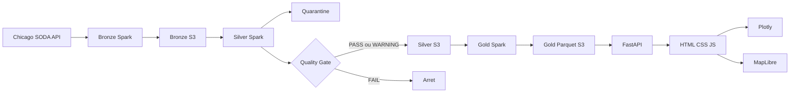

# Chicago Taxi Intelligence

Application locale issue de `pandas_only_draft.executed.ipynb` : PySpark pour
Bronze/Silver/Gold, FastAPI pour le service HTTP, HTML/CSS/JavaScript pour les
analyses et la carte. Aucun React, Node, Streamlit ni cluster Spark necessaire.

## Demarrer

Le parcours de livraison du test est Docker Compose. Depuis ce repertoire :

```powershell
docker compose up --build -d
docker compose exec airflow airflow dags trigger chicago_taxi_batch_pipeline
```

Attendre que les services soient prets avant de declencher le DAG. La date par
defaut est **2023-06-01**, une journee reelle complete de Chicago (pas le dataset
synthetique). Pour une autre date, utiliser le formulaire Trigger d'Airflow.

Dashboard : http://localhost:18000 ; Airflow : http://localhost:18080
(identifiants locaux artefact / chicago-local) ; objets : http://localhost:18888.
Les details, les limites et les commandes sont dans [Docker](docs/docker.md).

## Alternative locale sans Docker

Depuis ce repertoire, dans PowerShell :

```powershell
python -m pip install -r requirements-pipeline.txt -r requirements-app.txt
python -m scripts.build_demo
powershell -ExecutionPolicy Bypass -File scripts/serve.ps1
```

Dashboard : http://localhost:8000 ; API : http://localhost:8000/docs.
La demonstration est synthetique et identifiee comme telle dans l'interface.
Java est requis par Spark. Sous Windows, les helpers locaux sont dans .hadoop.
Le serveur lit .env.local : CARTO_BASEMAP_KEY reste cote serveur ; Foursquare
est optionnel. Ne pas publier ce fichier. CHICAGO_DATA_ROOT=data/demo selectionne
la demonstration. Sans .env.local, configurer les variables listees dans .env.example.

Pour les donnees reelles, attendre la fin du pipeline avant de lancer le serveur :

```powershell
python -m scripts.run_pipeline --processing-date 2023-06-01
powershell -ExecutionPolicy Bypass -File scripts/serve.ps1 -Live
```

Toutes les commandes individuelles, changement de port, arret par Ctrl+C et
explications des dates sont dans [le guide de lancement](docs/launch.md).

## Architecture



Gold contient daily, hourly, zones, payments, companies, geo, trips et
kpi_summary. Les pages sont Overview, Operations, Geography et Data Quality.
Les routes principales sont /api/health, /api/kpis, /api/daily, /api/hourly,
/api/zones, /api/payments, /api/companies, /api/trips, /api/trips/{trip_id},
/api/geo/pickups, /api/geo/trips, /api/data-quality/summary, /errors, /warnings.
Les deux dernieres routes ont aussi le prefixe /api/data-quality.
Foursquare /api/places/nearby est appele seulement a la demande et mis en cache.
Les lignes cartographiques relient des centroides, pas un itineraire GPS.

## Documentation et code

- [Architecture et provenance notebook/Graphify](docs/architecture.md)
- [Bronze](docs/bronze.md), [Silver et regles DQ](docs/silver.md), [Gold](docs/gold.md)
- [API](docs/api.md), [frontend](docs/frontend.md), [DataOps](docs/dataops.md)
- [Stockage objet](docs/storage.md), [Docker Compose](docs/docker.md)
- [Airflow](docs/airflow.md) : un DAG, huit taches, aucun traitement metier dans le DAG
- [Rapport de livraison](docs/reports/livraison.md) : preuves de validation et limites
- [Annexe de tout le code actif](docs/reports/code_complet.md), generee par `python -m scripts.export_code_report`

Le notebook et le graphe Graphify global restent dans le repertoire d'origine ;
ils ne sont pas necessaires pour executer cette application autonome.
Graphify couvre desormais l'ensemble du projet, pas seulement le notebook.
Les anciens modules ne sont pas inclus dans ce dossier.

## Tests

```powershell
python -m pytest tests -q
$env:CHICAGO_TEST_URL="http://127.0.0.1:18000"
python -m scripts.check_frontend
python scripts/check_release.py --processing-date 2023-06-01 --runs 2
```

Le test frontend vise Compose sur le port 18000. En mode local, remplacer cette
URL par `http://127.0.0.1:8000`. Il exige Playwright et Chromium.
Il enregistre ses captures et son resultat dans docs/reports.
Installation du navigateur de test : `python -m pip install playwright`, puis
`python -m playwright install chromium`.

## Limites importantes

- Pipeline batch local, pas un stockage transactionnel distribue. Eviter deux
  executions simultanees sur une date et les synchronisations OneDrive actives.
- Une relance remplace la partition de la date apres validation ; rapports et
  logs restent par run_id. Les anciens Parquets restent archives dans les runs
  S3 ; seules les partitions locales de travail sont remplacees.
- Bronze est plafonne par max_pages ; DataOps refuse les extractions incompletes
  par defaut. Augmenter ce parametre pour une journee complete.
- L'API charge les trajets Gold en RAM : adapte a une application locale,
  pas a plusieurs annees de trajets sans autre moteur de requete.
- Horodatages source sans conversion de fuseau Chicago ; metriques monetaires
  DOUBLE fideles au notebook, pas un grand livre comptable.
- JavaScript, polices et tuiles utilisent Internet. Foursquare sans cle reste
  indisponible sans bloquer le reste de l'application.
- Les preuves Compose, S3, API et navigateur sont conservees dans docs/reports.

## Arbitrages du test

SODA est appele en JSON pour eviter les ambiguites de parsing CSV. Bronze garde
les enregistrements natifs sous _raw/records.json en plus du Parquet tout-string.
Silver type, controle et garde au plus une ligne valide par trip_id. Les autres
occurrences sont en quarantaine avec DUPLICATE_TRIP_ID_EXCLUDED ; le choix
privilegie une ligne sans erreur, puis un ordre stable des valeurs metier.

Spark utilise le disque local comme espace de travail et boto3 materialise
chaque couche dans S3. Silver/Gold restaurent leur source depuis S3 ; l'API ne
partage pas ce disque de travail. Cela reste simple a executer sur un poste,
au prix de copies supplementaires. PostgreSQL ne contient que les metadonnees
Airflow, pas les trajets. Aucune dependance a un service cloud payant.

Avec plus de temps : lecture Spark S3A, format transactionnel, retention des
snapshots, verrous de publication entre pipelines, traitement de plusieurs
jours sans accumulation Python, moteur SQL pour les grands volumes, CI et
gestion stricte des secrets. Ces evolutions ne sont pas presentees comme acquises.
