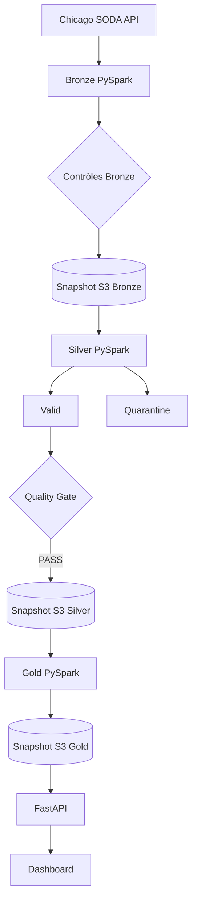

# Architecture technique

Le projet est parti du notebook `notebooks/pandas_only_draft.executed.ipynb`. Cette V1 Pandas a permis de valider l'extraction, les règles métier, les agrégats et la carte. La version actuelle conserve cette logique fonctionnelle, mais sépare les responsabilités en jobs PySpark, contrôles DataOps, orchestration Airflow, stockage S3 et application web.

## Flux de données



## Responsabilités

| Module | Responsabilité |
|---|---|
| `src/bronze` | filtre temporel SODA, pagination et conservation de la source |
| `src/silver` | cast des types, règles, déduplication et quarantine |
| `src/gold` | huit tables analytiques et réconciliations |
| `src/dataops` | validation, Quality Gate, manifests et audit |
| `scripts/run_stage.py` | restauration S3, job, contrôle et publication |
| `dags/` | orchestration d'une date ou d'une plage |
| `src/api` | lecture du dernier snapshot Gold et endpoints HTTP |
| `frontend/` | dashboard HTML, CSS et JavaScript |

## Partitionnement et idempotence

`processing_date` est la date métier. Pour `2023-06-01`, la requête source couvre l'intervalle `[2023-06-01 00:00:00, 2023-06-02 00:00:00[`.

```text
data/bronze/chicago_taxi/processing_date=2023-06-01/
data/silver/chicago_taxi/processing_date=2023-06-01/
data/quarantine/chicago_taxi/processing_date=2023-06-01/
```

Une nouvelle date crée une nouvelle partition. Une relance écrit d'abord dans `_tmp/<run_id>`, relit et valide le Parquet, puis remplace la partition finale. Si la promotion échoue, l'ancienne partition est restaurée.

`run_id` identifie une tentative technique. Il est différent à chaque exécution et relie les logs, rapports et snapshots S3. Il ne sert pas à sélectionner les données métier.

## Formats

- JSON brut: preuve fidèle des réponses SODA.
- Parquet: données Bronze, Silver, Quarantine et Gold.
- JSON/CSV: manifests et petits rapports de contrôle.

Spark ignore les marqueurs dont le nom commence par `_`. Le fichier `_bronze_run.json` relie une partition Silver au run Bronze qui l'a produite.

## Stockage objet

Le filesystem du conteneur sert d'espace de travail Spark. Le stockage durable est S3-compatible. Une publication contient un inventaire SHA-256 et un pointeur `latest.json` n'est déplacé qu'après validation complète.

L'API dispose de son propre cache et télécharge le dernier snapshot Gold depuis S3. Elle ne lance pas Spark.

## Limites

Bronze garde les pages d'une journée en mémoire Python avant la création du DataFrame. L'API charge les tables Gold destinées au dashboard en RAM. Le Compose utilise un Spark local et une seule tâche Airflow à la fois: ce choix privilégie une démonstration reproductible sur une machine de développement.

Les timestamps source n'indiquent pas explicitement leur fuseau. La session Spark est en UTC et aucune conversion `America/Chicago` n'est appliquée. Les lignes de la carte joignent des centroïdes de zones et ne représentent pas un trajet GPS.

Voir aussi: [DataOps](dataops.md), [stockage](storage.md), [Airflow](airflow.md), [API](api.md) et [Docker](docker.md).
