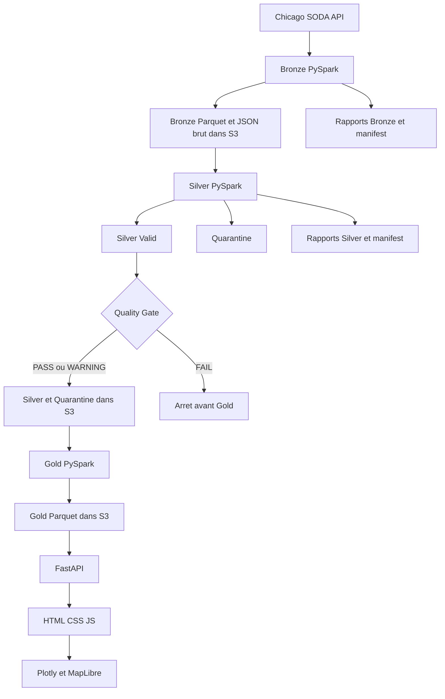

# Architecture locale : du notebook au dashboard

## Le point de depart

La reference fonctionnelle initiale est `notebooks/pandas_only_draft.executed.ipynb`
dans le depot d'origine ; elle n'est pas requise pour executer le dossier autonome.
Ce notebook contient une V1 Pandas avec Bronze, Silver, Gold, des rapports, des
logs et une carte. Les couches Bronze, Silver et Gold sont maintenant en PySpark ;
FastAPI sert une interface HTML/CSS/JavaScript et DataOps controle les publications.
Le notebook a ete lu directement avant l'implementation. Graphify a servi
a retrouver les fonctions et leurs relations dans son export Python.

Le graphe courant du depot d'origine est `graphify-out/graph.html`.
Depuis la demande du 14 septembre 2026, il couvre l'ensemble du projet,
et plus seulement le notebook. La requete `graphify query 'build_silver'`
retrouve notamment les liens avec `generate_run_id`, `create_logger`,
`add_error`, `add_warning`, `build_column_profile` et `save_json`.
Deux cellules du notebook definissent `build_silver` ; leurs sources sont identiques.
La seconde definition executee est celle qui reste en memoire dans Jupyter.
Le graphe aide a naviguer, mais les tests et le code source restent necessaires
pour verifier le comportement de la version Spark. Voir [graphify.md](graphify.md)
pour les commandes et les exclusions. Le notebook reste une reference historique
metier, pas une restriction du perimetre Graphify.

## Le chemin des donnees

La version de livraison est lancee par Docker Compose depuis chicago_taxi_app.
Chaque couche est materialisee dans le stockage objet S3. Le filesystem reste
un espace de travail Spark et un cache API, pas le socle persistant du datalake.
Voir [storage.md](storage.md) et [docker.md](docker.md) pour les publications.



Un trajet arrive comme un enregistrement JSON de l'API. Bronze conserve ses
champs sans appliquer de decision metier. Silver les convertit, calcule des
colonnes utiles, puis determine si le trajet est valide ou doit etre isole.
Les rapports expliquent ce qui s'est passe, independamment des fichiers Parquet.

## Pourquoi Medallion ?

Une architecture Medallion separe les responsabilites en couches. Cela permet
de garder une entree pour diagnostiquer une transformation et de relancer une
etape sans retelecharger la source. Les trois couches ont des roles distincts :

- Bronze : ce que la source nous a donne pour la journee choisie.
- Silver : ce que nous pouvons utiliser apres typage et controles documentes.

- Gold : les agregats analytiques et une projection legere des trajets valides.

L'API charge cette projection Gold dans Pandas pour les filtres croises et les
reponses JSON. Elle ne lance jamais Spark et ne lit pas les trajets Silver.
Les rapports Silver sont lus uniquement pour la page Data Quality.

## Fichiers actifs

```text
src/common.py             outils locaux partages
src/bronze/__main__.py    API, qualite Bronze, orchestration Bronze
src/silver/__main__.py    schema, regles, orchestration Silver
src/gold/__main__.py      tables metier et reconciliation
src/dataops/__main__.py   controles de publication, gate et audit
src/api/main.py           routes HTTP et fichiers statiques
src/api/service.py        lecture Gold, filtres, cache et enrichissement
frontend/                HTML, CSS et JavaScript sans compilation
dags/                    orchestration Airflow, sans logique metier
```

Les dossiers `src/bronze/` et `src/silver/` existaient deja. Un `__main__.py`
permet `python -m src.bronze` et `python -m src.silver` sans creer un fichier
`bronze.py` en conflit avec le package du meme nom. C'est la seule adaptation
a la structure proposee. Les deux `__init__.py` restent de simples fichiers
de package. Les jobs actifs importent `src.common` ; ils ne dependent pas des
anciens frameworks ou classes du depot.

Les fichiers historiques, dont `src/bronze/job.py`, `src/silver/job.py` et
`src/silver/pipeline.py`, sont conserves. Les commandes ci-dessous constituent
le parcours recommande pour cette version simple. Les anciens tests ne valident
pas automatiquement ces nouveaux points d'entree.

## processing_date et run_id

`processing_date` est une date metier. Pour `2023-06-01`, Bronze demande les
trajets dont le debut est compris entre le 1er juin a minuit inclus et le
2 juin a minuit exclu. Silver lit exactement cette partition Bronze.

`run_id` identifie une tentative technique. Exemple fictif :
`BRZ_20260913T120000Z_a1b2c3d4`. Il combine la couche, l'heure UTC et un suffixe
aleatoire. Deux executions du meme jour metier ont normalement deux run_id
differents, meme si elles commencent dans la meme seconde.

Une nouvelle date produit une nouvelle partition. Une relance de la meme date
remplace la partition de cette date apres validation. Elle conserve des rapports
et logs distincts, car ils sont ranges par run_id. Les versions precedentes des
donnees ne sont pas archivees : garder les rapports n'est pas garder un historique
complet des fichiers de trajets.

## Parquet et partitionnement

Parquet est un format de stockage par colonnes, avec un schema. Spark peut
relire seulement les colonnes utiles. Un dataset Parquet est ici un dossier
contenant plusieurs fichiers `part-*.parquet`, pas necessairement un fichier unique.

```text
data/bronze/chicago_taxi/processing_date=2023-06-01/
data/silver/chicago_taxi/processing_date=2023-06-01/
data/quarantine/chicago_taxi/processing_date=2023-06-01/
```

La date est encodee dans le nom du dossier. Le job n'utilise pas `run_id=*`
pour choisir ses entrees et ne lit pas toutes les partitions a la fois.
Une partition `processing_date=X` est remplacee dans son ensemble, sans melange
des anciens et nouveaux fichiers. Les metadonnees techniques de deux runs
different : il ne faut pas comparer leurs Parquets octet par octet.

## Staging : ecrire avant de remplacer

Le staging est un dossier temporaire situe sous `_tmp/<run_id>/` dans la meme
racine que la sortie. Le job ecrit le Parquet, le relit et verifie son nombre
de lignes et ses types. Ensuite seulement, il remplace la partition finale.

`promote` garde temporairement l'ancienne partition sous un nom `.previous`.
Si le renommage du staging echoue, il restaure cette ancienne partition.
Apres reussite, il supprime la sauvegarde. Ce sont quelques operations locales
de fichiers, pas un moteur transactionnel.

Silver valide les deux stagings avant de les promouvoir successivement.
Les deux promotions et le manifest ne constituent pas une transaction globale.
Si la deuxieme promotion echoue, la premiere peut deja etre visible. Le run est
alors FAILED et doit etre relance. Une coupure machine, des ecritures concurrentes
sur la meme date ou une synchronisation OneDrive peuvent necessiter une intervention.
Executer un seul job par couche et date, et attendre SUCCESS avant consommation.

## Lineage : qui a produit cette partition ?

Bronze ecrit `_bronze_run.json` dans son staging. Ce fichier contient son run_id
et est deplace avec le Parquet. Son nom commence par `_` pour que Spark l'ignore
lors de la lecture des donnees. Silver lit ce fichier et enregistre la valeur
dans `source_run_id` du manifest et `_source_run_id` de chaque ligne.

Pour les anciennes partitions sans marqueur, Silver cherche un manifest Bronze
SUCCESS de meme date et meme chemin, puis retient le plus recent. C'est un mode
de compatibilite moins fort que le marqueur. Sans provenance disponible, Silver
echoue explicitement et demande de produire la partition avec Bronze.
Le marqueur ne remplace pas une empreinte du contenu ni un archivage des versions.

## Quarantine

Quarantine est une sortie de donnees, pas une corbeille. Une ligne y arrive si
au moins une erreur bloquante s'applique. Elle garde les noms de ces erreurs et
ses warnings eventuels. Cela permet de comprendre et quantifier les rejets.
Elle contient les valeurs apres conversion : le texte source original reste
dans Bronze tant que cette partition n'est pas remplacee.

## Les outils communs, fonction par fonction

| Fonction dans common.py | Role |
|---|---|
| utc_now | Horodatage UTC serialisable en JSON |
| new_run_id | Identifiant technique avec couche et UUID court |
| parse_args | Lecture de --processing-date et --config |
| load_config | Lecture du fichier YAML ; un fichier absent est une erreur |
| partition_path | Validation de la date et construction du chemin absolu |
| create_spark | Session locale et configuration Hadoop Windows du projet |
| create_logger | Log dans un fichier et sur la console |
| close_logger | Fermeture des fichiers de log en fin de traitement |
| write_json | Petit JSON ecrit en temporaire puis remplace |
| write_csv | Petit rapport CSV avec en-tete, meme sans ligne |
| column_profile | Agregation des NULL et distincts, une ligne par colonne |
| write_staging | Ecriture Spark et relecture de validation |
| promote | Remplacement local avec sauvegarde temporaire |
| cleanup | Suppression du staging appartenant au run termine |

`column_profile` utilise des agregations Spark. Il ne rapatrie pas les trajets
dans Pandas. Les `collect()` autorises concernent uniquement de petits rapports.
Les boucles Python parcourent les noms de colonnes ou les pages API, jamais les
lignes Spark pour appliquer une regle metier. Les lignes JSON recues par l'API
sont preparees localement avant creation du DataFrame Bronze.

## Lancer et verifier

Depuis la racine du projet :

```powershell
python -m src.bronze --processing-date 2023-06-01
python -m src.silver --processing-date 2023-06-01
python -m pytest tests/test_bronze.py tests/test_silver.py -q
```

Lire [bronze.md](bronze.md) puis [silver.md](silver.md) pour les exemples et les
details des regles. Le [code complet](reports/code_complet.md) est fourni
en annexe comme instantane de lecture. Les sources executables restent dans `src/`.
Les resultats de verification sont dans [livraison.md](reports/livraison.md).

## Limites communes

Cette version est locale : Spark utilise `local[1]` sur Windows et `local[*]`
ailleurs par defaut, avec surcharge possible par SPARK_MASTER et des chemins filesystem,
pas un stockage objet. Le nombre de partitions Spark n'est pas force a un seul
fichier. Les fenetres de doublons et les distincts exacts peuvent etre couteux.
Les tests portent sur des fixtures et des appels API simules. Ils ne prouvent
pas la disponibilite actuelle du service Chicago ni les performances sur un trimestre.
La configuration actuelle plafonne Bronze a deux pages ; verifier
`pagination_complete` avant de supposer que la journee est complete.

La session Spark est en UTC. La source fournit des timestamps sans fuseau ;
aucune conversion explicite de America/Chicago vers UTC n'est ajoutee ici.
Le Quality Gate applique maintenant les seuils YAML avant Gold dans le lanceur
complet et le DAG. Une commande Gold lancee seule ne l'impose pas : elle exige
Silver Trusted et ses reconciliations, mais ne remplace pas l'orchestration.
Voir [DataOps](dataops.md), [Gold](gold.md), [API](api.md), [frontend](frontend.md)
et [lancement manuel](launch.md). Le rapport de livraison precise ce qui a ete
effectivement execute, notamment pour Airflow et Docker.
